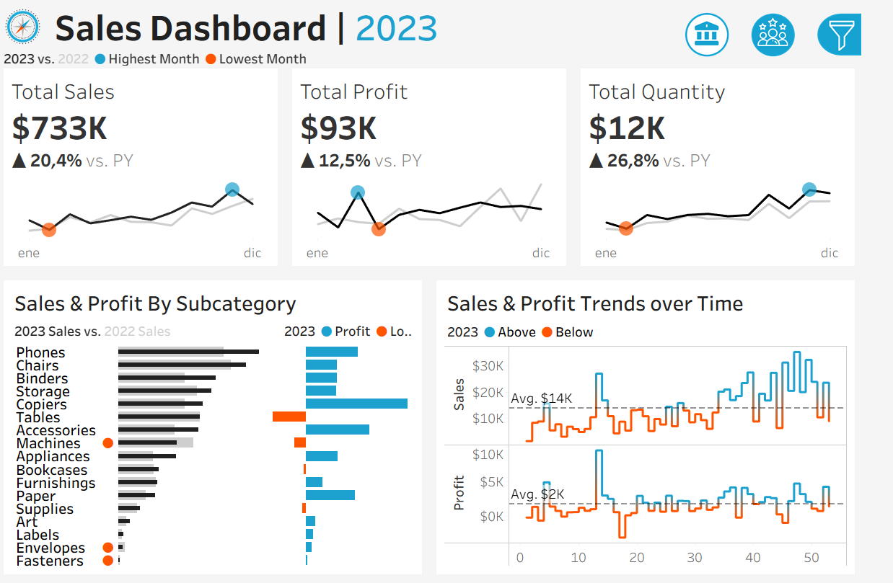
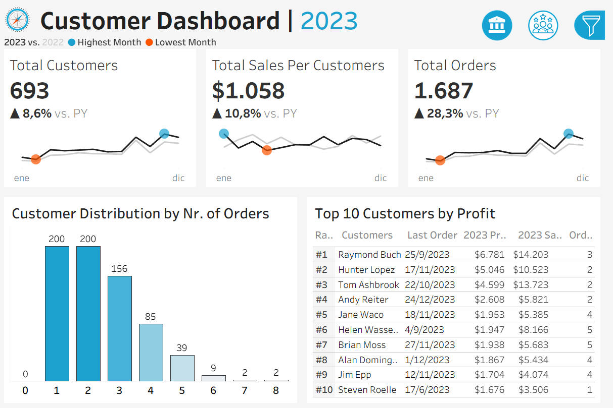

# 📊 Análisis de Rendimiento de Ventas y Clientes con Tableau

Este proyecto consiste en la construcción de dashboards interactivos en Tableau para analizar el rendimiento de ventas y el comportamiento de los clientes. El objetivo es proporcionar insights accionables a managers y equipos ejecutivos mediante la comparación de métricas clave entre distintos años, productos y segmentos de clientes.

---

## 🗂️ Dataset utilizado

El proyecto está basado en datos estructurados distribuidos en los siguientes archivos:

- `Orders.csv` – Detalles de pedidos realizados
- `Customers.csv` – Información sobre los clientes
- `Products.csv` – Datos de productos, categorías y subcategorías
- `Location.csv` – Regiones, estados y ciudades

Se trabajó con dos regiones distintas: **Europa** y **Resto del mundo**, cada una con sus respectivos datasets.

---

## 🎯 Objetivo

Construir dos dashboards principales:

1. **Sales Dashboard** – Visualizar el rendimiento de ventas en términos de ventas totales, utilidades y cantidad.

  
3. **Customer Dashboard** – Comprender tendencias y patrones en la base de clientes.

Ambos dashboards permiten comparar métricas entre el año actual y el anterior, y explorar tendencias mensuales, semanales y por producto o región.

---

## 📌 Funcionalidades implementadas

### 📈 Dashboard de Ventas

- **KPIs principales**: Total de ventas, utilidades y cantidad vendida (actual vs. año anterior).
- **Tendencias mensuales**: Comparación año a año.
- **Tendencias semanales**: Ventas y utilidades por semana con promedios y resaltado de valores fuera de la media.
- **Comparación por subcategoría**: Visualización paralela de ventas y utilidades para cada subcategoría.
- **Mes de mayor y menor rendimiento**: Marcados visualmente con íconos de color.

### 👥 Dashboard de Clientes

- **KPIs principales**: Total de clientes, ventas por cliente, total de órdenes (actual vs. año anterior).
- **Distribución de clientes por cantidad de órdenes**: Para analizar fidelización y comportamiento.
- **Top 10 clientes por utilidad**: Incluye nombre, fecha del último pedido, ventas y utilidad generadas.
- **Evolución mensual**: De clientes, ventas por cliente y órdenes.

---

## 🧭 Interactividad

- Filtro dinámico por año (Selector: `Select Year`)
- Filtros adicionales por:
  - Categoría
  - Subcategoría
  - Región
  - Estado
  - Ciudad
- Acciones de dashboard entre hojas para navegación cruzada

---

## 🛠️ Herramientas utilizadas

- **Tableau Desktop**: Visualización interactiva de datos
- **Excel / CSV**: Manipulación y carga de datos
- **Fórmulas calculadas**: Comparación entre años, etiquetas dinámicas, promedios semanales, etc.

---

## 🧠 Insights principales

- El rendimiento de ventas mejoró en 2023 respecto a 2022 en todas las métricas clave.
- Los picos de ventas y utilidades se observan en el último trimestre del año.
- Clientes con más órdenes generan mayor rentabilidad, pero también se observan casos de alto valor con pocas órdenes.
- Las subcategorías como *Phones* y *Chairs* lideran en ventas y utilidad.

---

## 👤 Autor

**Octavio Alvarez**  
Data Analyst | Tableau Developer  
📍 Argentina  
🔗 [LinkedIn](https://www.linkedin.com/in/octavioalvarez1/)  
